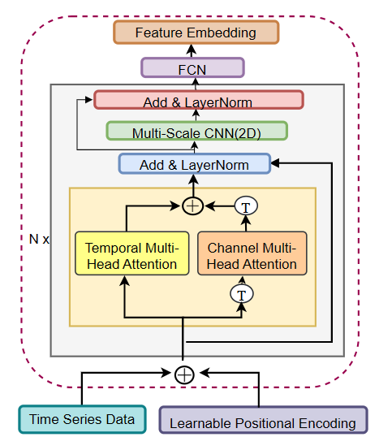

# 🧠 STDual-X: Spatio-Temporal Dual Attention Transformer with Cross-Sensor Attention for Human Activity Recognition

## 📄 Abstract
Human Activity Recognition (HAR) is essential in various fields, including healthcare, surveillance, and sports. HAR based on Inertial Measurement Unit (IMU) sensor data has recently gained attention due to its **non-intrusive** and **straightforward data acquisition** process compared to video-based or electromyogram (EMG)-based approaches.  

Human activities exhibit **complex spatiotemporal dynamics**, necessitating the extraction of discriminative spatiotemporal features from IMU data to develop effective HAR systems. While deep learning models have been extensively explored for HAR, existing approaches often struggle to capture these intricate patterns. Moreover, they often **overlook coordinated movements** across multiple body parts and fail to **utilize inter-sensor relationships** effectively.

This work introduces **STDual-X**, a novel HAR framework that employs **Spatio-Temporal Dual Attention Transformers (STDAT)** with **Cross-Sensor Attention (CSA)** to enhance activity recognition accuracy.  
- **STDAT** extracts rich spatiotemporal representations from IMU signals.  
- **CSA** leverages relationships among multiple sensors placed on different body parts to improve classification performance.  

Experiments conducted on benchmark public datasets — **PAMAP2**, **Opportunity**, and **UCI-HAR** — demonstrate the effectiveness of the proposed framework, achieving **state-of-the-art accuracies**:
- PAMAP2: **97.02%**
- Opportunity: **95.43%**
- UCI-HAR: **98.80%**

---

## 🧩 Key Features
- ✅ Dual Attention Mechanism — spatial and temporal attention fusion  
- ✅ Cross-Sensor Attention (CSA) to model inter-sensor dependencies  
- ✅ Transformer-based encoder for contextual feature extraction  
- ✅ Improved HAR accuracy using multi-sensor IMU data  
- ✅ Tested on three benchmark HAR datasets  

---

## 🏗️ Architecture Overview

## 🏗️ Architecture Overview

Below is the architecture of the **STDual-X** framework illustrating the integration of Spatio-Temporal Dual Attention and Cross-Sensor Attention:

<p align="center">
  
</p>

- **Spatio Temporal Attention**: Captures sensor-wise importance and Extracts motion dynamics over time.  
<p align="center">
  
</p>
- **Cross-Sensor Attention**: Models relationships across different body sensors (e.g., wrist, ankle, chest).  
<p align="center">
  
</p>
---

## 📊 Datasets
The proposed model has been evaluated on the following **publicly available IMU-based HAR datasets**:
- **[PAMAP2](https://archive.ics.uci.edu/ml/datasets/pamap2+physical+activity+monitoring)**  
- **[Opportunity Dataset](https://archive.ics.uci.edu/ml/datasets/Opportunity+Activity+Recognition)**  
- **[UCI-HAR](https://archive.ics.uci.edu/ml/datasets/human+activity+recognition+using+smartphones)**  

Each dataset includes IMU readings from multiple body positions (e.g., wrist, ankle, chest) capturing accelerometer, gyroscope, and magnetometer signals.

---

## 🧠 Model Components
| Component | Description |
|------------|-------------|
| **Feature Extractor** | Projects IMU data into latent embedding space |
| **Spatio-Temporal Dual Attention (STDAT)** | Learns both spatial (sensor) and temporal (time-step) relationships |
| **Cross-Sensor Attention (CSA)** | Incorporates inter-sensor correlations to improve recognition |
| **Classification Head** | Fully connected layers with softmax activation for activity prediction |

---

## 🚀 Results
| Dataset | Accuracy (%) |
|----------|---------------|
| PAMAP2 | **97.02** |
| Opportunity | **95.43** |
| UCI-HAR | **98.80** |

The results confirm the model’s ability to effectively capture **inter-sensor coordination** and **spatiotemporal motion patterns**.

---
## Authors
* Meenambika Chandirakumar
* Thanusanth Kanagarajah
* Nithursika Kalanatharasa
* Dr. Sandareka Wickramanakaye
* Prof. Dulani Meedaniya


## ⚙️ Installation & Usage

### 1️⃣ Clone the Repository
```bash
git clone https://github.com/MeenambikaC/Explainable-STDual-X
cd STDual-X
